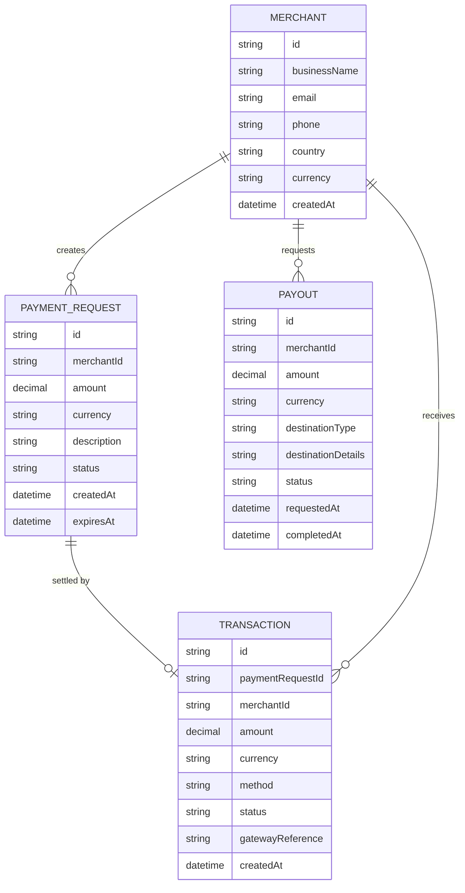

# Domain Model

The platform centers on a merchant collecting money through payment requests,
each settled by a transaction, with payouts drawing down the merchant's
balance.

- **Merchant** registers with basic business details; their `country` fixes
their `currency`.
- **PaymentRequest** is what a merchant creates for one sale; a customer pays
it as a guest. `status` moves `pending -> paid -> expired`.
- **Transaction** is the record of a customer's payment attempt against a
payment request, via the payment gateway (`method`: `mobile_money` or
`card`); `status` moves `pending -> successful|failed`.
- **Payout** is a merchant's request to withdraw their available balance to a
bank account or mobile money wallet (`destinationType`); `status` moves
`pending -> processing -> completed|failed`.

