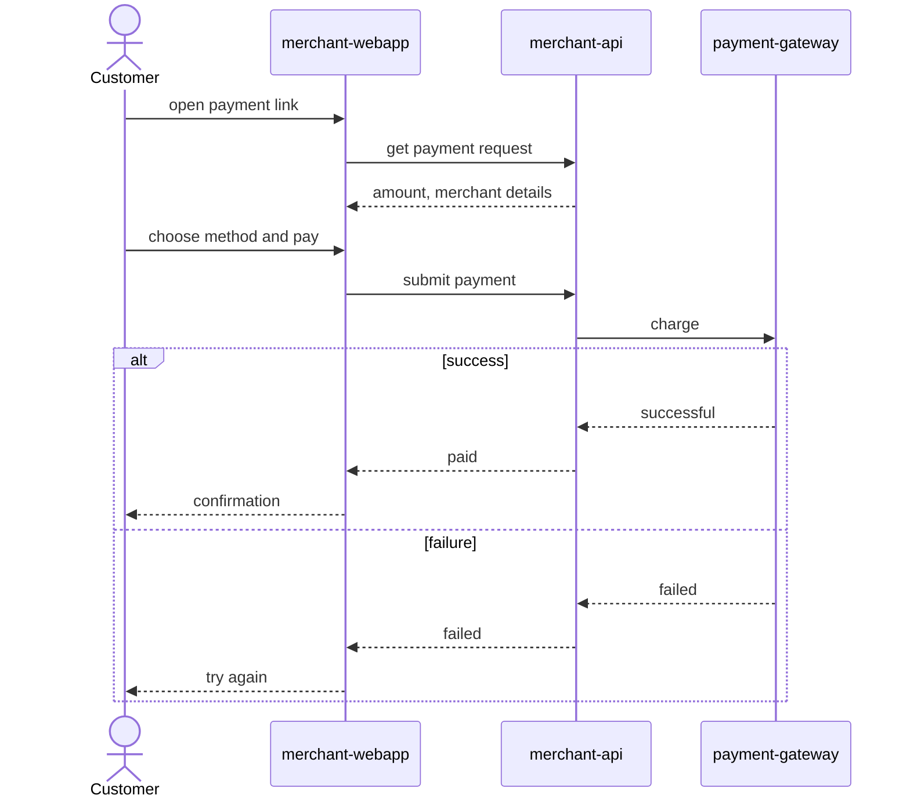

# Customer Guest Checkout

A customer opens a merchant's payment link and pays via mobile money or card,
with no account required.

```mermaid
sequenceDiagram
    actor Customer
    participant merchant-webapp
    participant merchant-api
    participant payment-gateway

    Customer->>merchant-webapp: open payment link
    merchant-webapp->>merchant-api: get payment request
    merchant-api-->>merchant-webapp: amount, merchant details
    Customer->>merchant-webapp: choose method and pay
    merchant-webapp->>merchant-api: submit payment
    merchant-api->>payment-gateway: charge
    alt success
        payment-gateway-->>merchant-api: successful
        merchant-api-->>merchant-webapp: paid
        merchant-webapp-->>Customer: confirmation
    else failure
        payment-gateway-->>merchant-api: failed
        merchant-api-->>merchant-webapp: failed
        merchant-webapp-->>Customer: try again
    end
```

