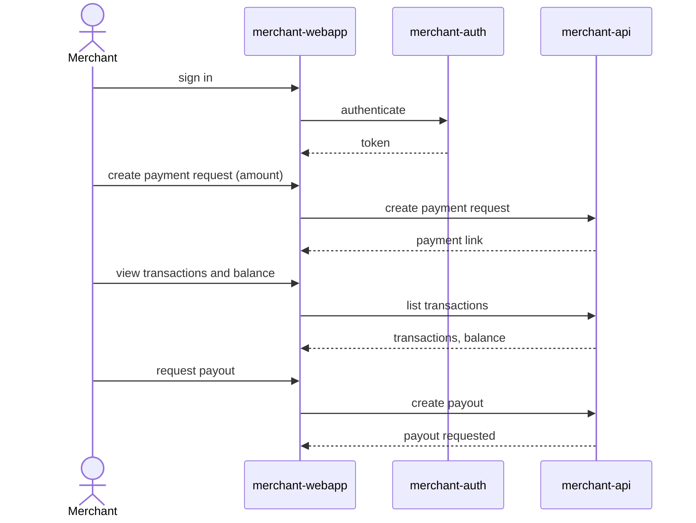

# Merchant Onboarding And Payment Collection

A merchant signs in, creates a payment request for a sale, then tracks
transactions, balance and payouts.

```mermaid
sequenceDiagram
    actor Merchant
    participant merchant-webapp
    participant merchant-auth
    participant merchant-api

    Merchant->>merchant-webapp: sign in
    merchant-webapp->>merchant-auth: authenticate
    merchant-auth-->>merchant-webapp: token
    Merchant->>merchant-webapp: create payment request (amount)
    merchant-webapp->>merchant-api: create payment request
    merchant-api-->>merchant-webapp: payment link
    Merchant->>merchant-webapp: view transactions and balance
    merchant-webapp->>merchant-api: list transactions
    merchant-api-->>merchant-webapp: transactions, balance
    Merchant->>merchant-webapp: request payout
    merchant-webapp->>merchant-api: create payout
    merchant-api-->>merchant-webapp: payout requested
```